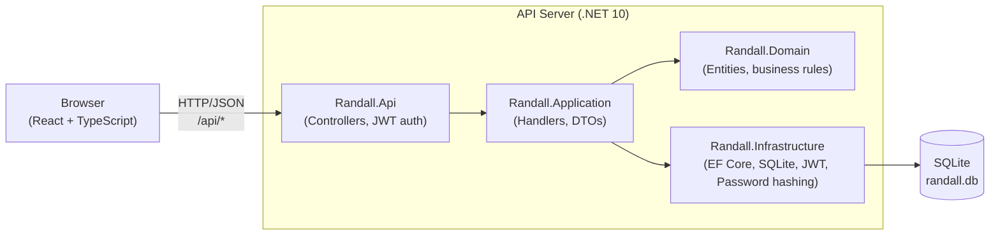

# Randall — Office Desk Reservation System

Randall is a web application for managing office desk reservations. Employees can browse available workplaces, make reservations up to two weeks in advance, and manage their own bookings. Admins can manage users and view the full office schedule.

## Features

**For employees**
- Register and sign in with email and password
- Browse all active desks and their locations
- See which desks are available on a given day
- Make a reservation (up to 14 days in advance)
- View and cancel their own upcoming reservations

**For admins**
- Approve new user registrations
- Elevate users to admin
- Remove users
- View the full office schedule — who is sitting where on any given day

## Architecture



### Backend — Clean Architecture

The backend follows Clean Architecture, enforcing a strict dependency rule: outer layers depend on inner layers, never the reverse.

| Layer | Project | Responsibility |
|---|---|---|
| API | `Randall.Api` | HTTP controllers, JWT middleware, request/response mapping |
| Application | `Randall.Application` | Use-case handlers, DTOs, interfaces |
| Domain | `Randall.Domain` | Entities, value objects, business rules, `Result<T>` pattern |
| Infrastructure | `Randall.Infrastructure` | EF Core + SQLite, repositories, password hashing (PBKDF2), JWT token generation |

### Frontend

Single-page application built with React 19, TypeScript, Vite, and Tailwind CSS. During development the Vite dev server proxies all `/api` requests to the backend, so no CORS configuration is needed locally.

### Authentication

JWT Bearer tokens, issued on login and valid for 7 days. Admin privileges are encoded as an `isAdmin` claim and enforced at the controller level. New registrations require admin approval before the account can be used.

### Data model

```
User
  ├── id, email (unique), name, passwordHash
  ├── isApproved  — false until an admin approves
  └── isAdmin     — auto-approves on creation

Workplace
  ├── id, name (e.g. D1), location (e.g. Pod A)
  └── isActive    — inactive desks are hidden

Reservation
  ├── id, workplaceId, employeeEmail, employeeName, date, status
  ├── One active reservation per employee per day
  └── One active reservation per workplace per day
```

### Test layers

| Layer | Technology | What it covers |
|---|---|---|
| Unit | xUnit | Domain entity logic and business rules in isolation |
| Integration | xUnit + `WebApplicationFactory` | HTTP endpoints, JWT/auth middleware, cross-layer wiring, in-process SQLite |
| E2E | Playwright | Full user journeys through the browser |

---

## Running locally for development

### Prerequisites

- [.NET 10 SDK](https://dotnet.microsoft.com/download)
- [Node.js 22](https://nodejs.org)

### 1. Start the backend

```bash
cd src/backend
dotnet run --project src/Randall.Api
```

The API starts at `http://localhost:5180`. On first run it creates `randall.db` in the working directory, runs migrations, and seeds 16 workplaces and one admin account.

**Swagger UI** is available at `http://localhost:5180/swagger` when running in Development mode.

**Default admin credentials**

| Field | Value |
|---|---|
| Email | `admin@randall.local` |
| Password | `Admin@123` |

### 2. Start the frontend

In a separate terminal:

```bash
cd src/frontend
npm install
npm run dev
```

The app is available at `http://localhost:5173`. API calls are proxied automatically to the backend — no extra configuration needed.

### Running tests locally

**Unit tests**
```bash
dotnet test src/backend/tests/unit/Randall.Domain.UnitTests
```

**Integration tests**
```bash
dotnet test src/backend/tests/integration/Randall.Api.IntegrationTests
```

Each integration test class spins up the full API in-process against a temporary SQLite database that is deleted when the test run completes.

**E2E tests** (requires both backend and frontend to be running)
```bash
cd tests/e2e
npm install
npx playwright install chromium
npx playwright test
```

---

## Running with Docker

The Docker setup builds and wires both services. From the repo root:

```bash
docker compose -f cicd/docker/docker-compose.yml up --build
```

The app is available at `http://localhost` (port 80 by default).

To set a custom JWT key, pass it as an environment variable:

```bash
JWT_KEY=your-secret-key docker compose -f cicd/docker/docker-compose.yml up --build
```

See [`cicd/docker/.env.example`](cicd/docker/.env.example) for all available options.
